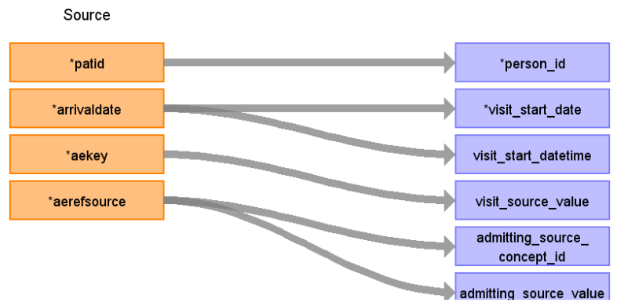

# CDM Table name: VISIT_OCCURRENCE (CDM v5.3 / v5.4)

**Reading from hesae_attendance to Visit_Occurrence CDM v5.3/ v5.4 table:**

**Figure.1**

| Destination Field | Source field | Logic | Comment field |
| --- | --- | --- | --- |
| visit_occurrence_id |  |  nextval('public.sequence_vo') AS visit_occurrence_id | A sequence called "sequence_vo" is created in the public schema to ensure the unique generation of visit_occurrence_id's. Firstly,the value of the sequence is determined by querying the maximum ID from a predefined source ({TARGET_SCHEMA_TO_LINK}._max_ids) where the field "tbl_name" = "visit_occurrence".The _max_ids table is established in the schema to be linked to the target schema, serving the purpose of storing maximum IDs for all CDM tables. This facilitates the determination of the next visit_occurrence_id in the sequence. | 
| person_id | patid |  |  |
| visit_concept_id |  | 9203 = "Emergency Room Visit" |  |
| visit_start_date | arrivaldate | MIN(arrivaldate) | The first Arrival date of that patid will be mapped to visit_start_date  |
| visit_start_datetime | arrivaldate | MIN(arrivaldate) |  |
| visit_end_date | arrivaldate| MAX(arrivaldate) | The last Arrival date of that patid will be mapped to visit_end_date|
| visit_end_datetime | arrivaldate | MAX(arrivaldate) | |
| visit_type_concept_id |  | 32818 = "EHR administration record” |  |
| provider_id | NULL | |  |
| care_site_id | NULL | |  |
| visit_source_value | aekey | | This will allow us to retrieve Visit_occurrence_id.  |
| visit_source_concept_id | NULL |  |  |
| admitting_source_concept_id | aerefsource |  | Check for OMOP codes from aerefsource |
| admitting_source_value | aerefsource |  | Definition to be added instead of number |
| discharge_to_concept_id | NULL |  | |
| discharge_to_source_value | NULL |  |  |
| preceding_visit_occurrence_id |  | | Using person_id, look up the attendances that occurred prior to this and put the visit_occurrence_id here.  |