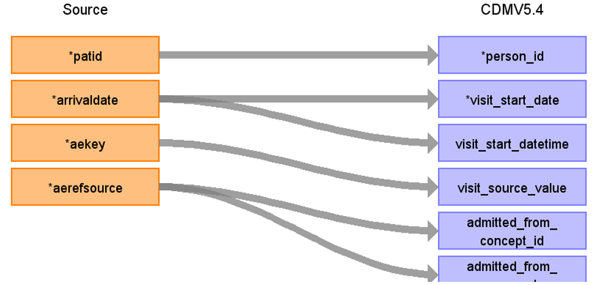

# CDM Table name: VISIT_OCCURRENCE (CDM v5.4)

**Reading from hesae_attendance to Visit_Occurrence CDM v5.4 table:**

**Figure.1**

| Destination Field | Source field | Logic | Comment field |
| --- | --- | --- | --- |
| visit_occurrence_id |  |  nextval('public.sequence_vo') AS visit_occurrence_id | A sequence named "sequence_vo" is created in the public schema to uniquely generate "visit_occurrence_id"s. It initializes by fetching the highest ID from the {TARGET_SCHEMA_TO_LINK}._max_ids table where "tbl_name" equals "visit_occurrence". This table, located in the schema to be linked to the target schema, stores the maximum IDs for all CDM tables to help set the starting point for the next ID in a given sequence.| 
| person_id | patid |  |  |
| visit_concept_id |  | 9203 = "Emergency Room Visit" |  |
| visit_start_date | arrivaldate | MIN(arrivaldate) | The first Arrival date of that patid will be mapped to visit_start_date  |
| visit_start_datetime | arrivaldate | MIN(arrivaldate) |  |
| visit_end_date | arrivaldate| MAX(arrivaldate) | The last Arrival date of that patid will be mapped to visit_end_date|
| visit_end_datetime | arrivaldate | MAX(arrivaldate) | |
| visit_type_concept_id |  | 32818 = "EHR administration record” |  |
| provider_id | NULL | |  |
| care_site_id | NULL | |  |
| visit_source_value | aekey | | This will allow us to retrieve Visit_occurrence_id.  |
| visit_source_concept_id | NULL |  |  |
| admitted_from_concept_id | aerefsource | use aerefsource to retrieve the target_concept_id from source_to_standard_vocab_map by doing a LEFT JOIN to source_to_standard_vocab_map as t1 on CAST(t1.source_code AS INTEGER) = hesae_attendance.aerefsource AND t1.source_vocabulary_id = “HESAE_REFSOURCE_STCM”. | Check for OMOP codes from aerefsource |
| admitted_from_source_value | aerefsource | use aerefsource to retrieve the source_code_description from source_to_standard_vocab_map by doing a LEFT JOIN to source_to_standard_vocab_map as t1 on CAST(t1.source_code AS INTEGER) = hesae_attendance.aerefsource AND t1.source_vocabulary_id = “HESAE_REFSOURCE_STCM”. | Definition to be added instead of number |
| discharged_to_concept_id | NULL |  | |
| discharged_to_source_value | NULL |  |  |
| preceding_visit_occurrence_id |  | | Using person_id, look up the attendances that occurred prior to this and put the visit_occurrence_id here.  |