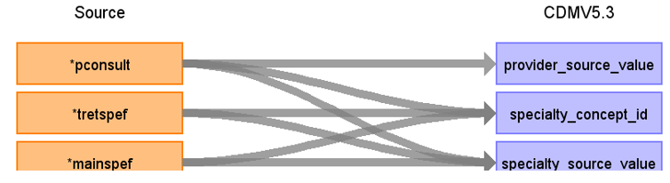

# CDM Table name: PROVIDER (CDM v5.3 / v5.4)

## Reading from hes_episodes

Use the hes_episodes table to populate the provider table.  

| Destination Field | Source field | Logic | Comment field |
| --- | --- | :---: | --- |
| provider_id |  | nextval('{TARGET_SCHEMA}.sequence_pro') AS provider_id | A sequence named sequence_pro is established in the TARGET_SCHEMA to generate provider_id's. The next value of this sequence is determined by fetching the highest value from a table named "_max_id". "_max_id" is a repository for maximum ID values across various tables in the CDM. It selects the specific maximum ID by filtering on the table_name column, where it matches 'provider'. Consequently, the sequence_pro sequence generates IDs based on the maximum value found in _max_id for the 'provider' table |
| provider_name | NULL |  |  |
| npi | NULL |  |  |
| dea | NULL |  |  |
| specialty_concept_id | tretspef,mainspef,pconsult | Specialty_concept_id will be mapped to SNOMED Concept_id by using tretspef if it is not equal to ‘&’ OR mainspef if is not equal to ‘&’ as Specialty WHERE Pconsult is not equal to '&' to retrieve the target_concept_id from source_to_concept_map WHERE source_code = Specialty AND source_vocabulary_id = “HES_SPEC_STCM”.|  |
| care_site_id |NULL | | |
| year_of_birth | NULL |  |  |
| gender_concept_id | NULL | |  |
| provider_source_value | pconsult |  |  |
| specialty_source_value | tretspef,mainspef,pconsult | Specialty_source_value will be mapped by using tretspef if it is not equal to ‘&’ OR mainspef if is not equal to ‘&’ as Specialty WHERE Pconsult is not equal to ‘&’ to retrieve the source_code_description from source_to_concept_map WHERE source_code = Specialty AND source_vocabulary_id = “HES_SPEC_STCM”.|  |
| specialty_source_concept_id | NULL |  | |
| gender_source_value | NULL| |  |
| gender_source_concept_id | NULL |  | |