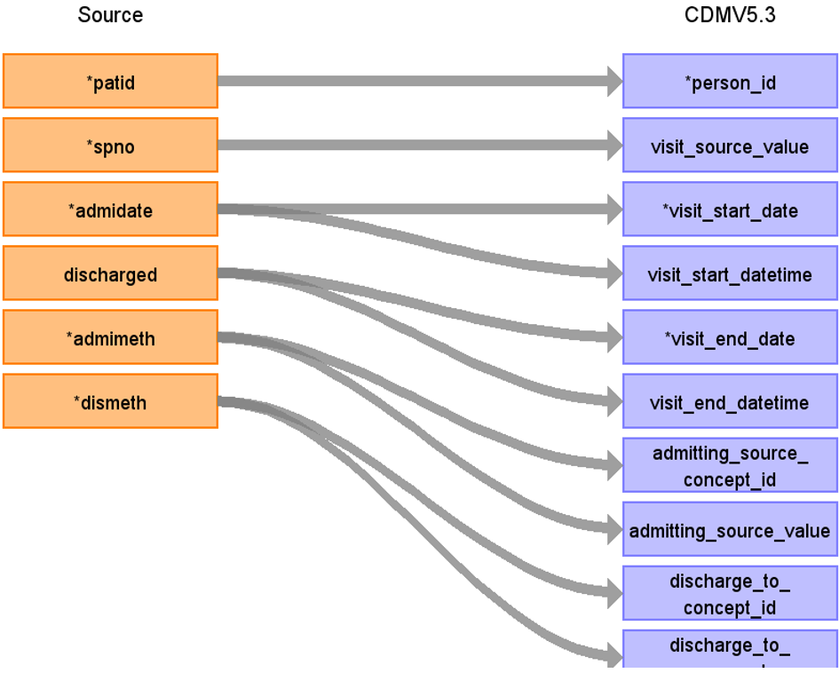

# CDM Table name: Visit_Occurrence (CDM v5.3)

## Reading from hes_hospital to Visit_Occurrence CDM v5.3 table:

**Figure.1**

| Destination Field | Source field | Logic | Comment field |
| --- | --- | :---: | --- |
| visit_occurrence_id |  |  nextval('public.sequence_vo') AS visit_occurrence_id | A sequence called "sequence_vo" is created in the public schema to ensure the unique generation of visit_occurrence_id's. Firstly,the value of the sequence is determined by querying the maximum ID from a predefined source ({TARGET_SCHEMA_TO_LINK}._max_ids) where the field "tbl_name" = "visit_occurrence".The _max_ids table is established in the schema to be linked to the target schema, serving the purpose of storing maximum IDs for all CDM tables. This facilitates the determination of the next visit_occurrence_id in the sequence. | 
| person_id | patid |  |  |
| visit_concept_id |  | 9201 = Inpatient visit  | |
| visit_start_date | admidate |  If admidate is null, use the first epistart in episode, and if also these are null, use discharges| COALESCE(admidate, MIN(epistart), discharged) |
| visit_start_datetime | admidate  | If admidate is null, use the first epistart in episode, and if also these are null, use discharges | COALESCE(admidate, MIN(epistart), discharged) |
| visit_end_date | discharged | If discharged is null, use the last epiend in episode, and if also those are null, use admidate or the first of epistart | COALESCE(discharged, MAX(epiend), admidate, MIN(epistart)) |
| visit_end_datetime | discharged |If discharged is null, use the last epiend in episode, and if also those are null, use admidate or the first of epistart| COALESCE(discharged, MAX(epiend), admidate, MIN(epistart)) |
| visit_type_concept_id |  | 32818 = EHR administration record |  |
| provider_id |NULL | |  |
| care_site_id | NULL| |  |
| visit_source_value | spno | This will allow us to retrieve Visit_occurrence_id. |  |
| visit_source_concept_id |NULL  |  |  |
| admitting_source_concept_id | admimeth |  | Check for OMOP codes from admimeth |
| admitting_source_value | admimeth |  | Definition to be added instead of number |
| discharge_to_concept_id | dismeth |  | Check for OMOP codes from dismeth |
| discharge_to_source_value | dismeth |  | Definition to be added instead of number |
| preceding_visit_occurrence_id |  |Using person_id, look up the hospitalisation that occurs prior to this and put the visit_occurrence_id here. |  |
