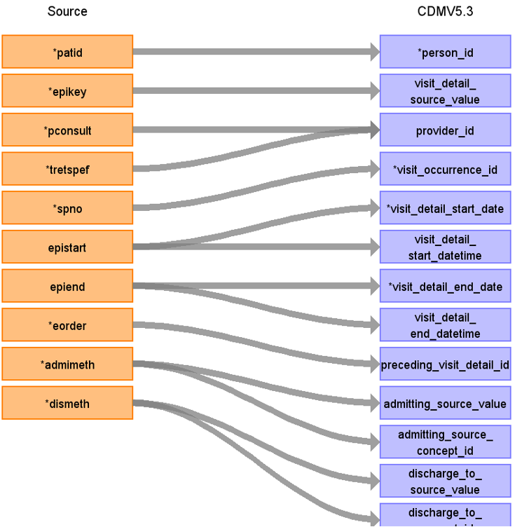
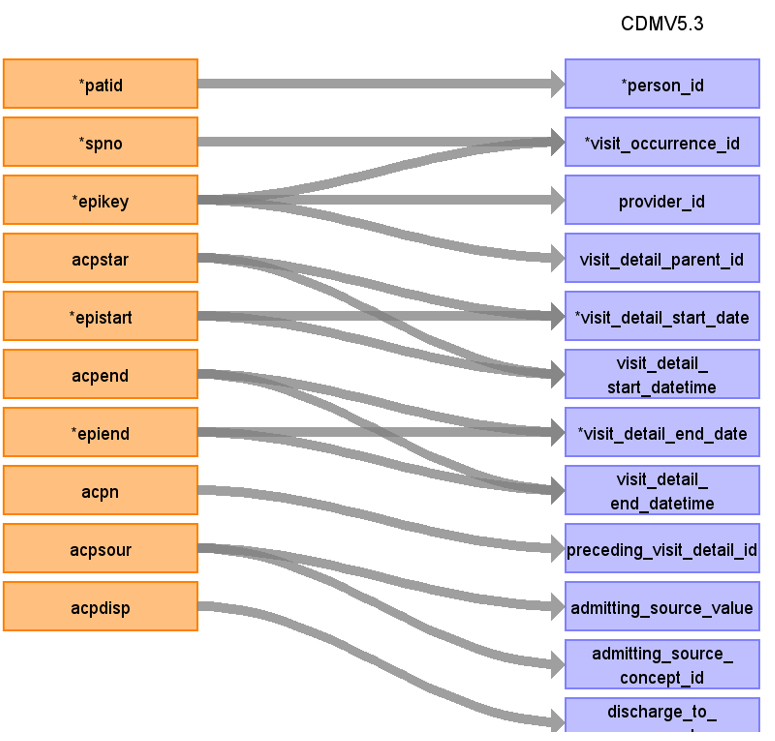
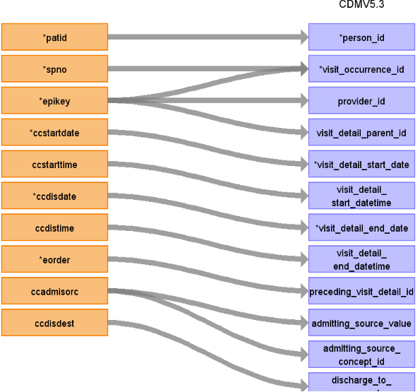

# CDM Table name: Visit_detail (CDM v5.3)

## Reading from hes_episodes to Visit_Detail CDM v5.3 table:

**Figure.1**

| Destination Field | Source field | Logic | Comment field |
| --- | --- | :---: | --- |
| visit_detail_id |  |  nextval('public.sequence_vd') AS visit_detail_id | A sequence called "sequence_vd" is created in the public schema to ensure the unique generation of visit_detail_id's. Firstly,the value of the sequence is determined by querying the maximum ID from a predefined source ({TARGET_SCHEMA_TO_LINK}._max_ids) where the field "tbl_name" = "visit_detail".The _max_ids table is established in the schema to be linked to the target schema, serving the purpose of storing maximum IDs for all CDM tables. This facilitates the determination of the next visit_detail_id in the sequence. |
| person_id | patid |  |  |
| visit_detail_concept_id |  | 9201 = Inpatient visit |  |
| visit_detail_start_date | epistart | If epistart is null, use admidate in hes_episodes, and if these are also null, use epiend | COALESCE(epistart, admidate, epiend) |
| visit_detail_start_datetime | epistart | If epistart is null, use admidate in hes_episodes, and if these are also null, use epiend | COALESCE(epistart, admidate, epiend) |
| visit_detail_end_date | epiend | If epiend is null, use discharged in hes_episodes, and if these are also null, use epistart | COALESCE(epiend, discharged, epistart) |
| visit_detail_end_datetime | epiend | If epiend is null, use discharged in hes_episodes, and if these are also null, use epistart | COALESCE(epiend, discharged, epistart) |
| visit_detail_type_concept_id |  | 32818 = "EHR administration record” |  |
| provider_id | pconsult | use hes_episode.pconsult inorder to retrieve the provider_id from provider by LEFT JOINING provider as t1 on  t1.provider_source_value = hes_episode.pconsult. | |
| care_site_id |NULL |  |  |
| visit_detail_source_value | epikey | | This will allow us to retrieve visit_detail_id using patid. |
| visit_detail_source_concept_id | NULL|  | |
| admitting_source_concept_id | admimeth | use admimeth to retrieve the target_concept_id from source_to_standard_vocab_map by doing a LEFT JOIN to source_to_standard_vocab_map as t1 on hes_hospital.admimeth = t1.source_code AND t1.source_vocabulary_id = “HESAPC_ADMIMETH_STCM”. | Check for OMOP codes from admimeth |
| admitting_source_value | admimeth | use admimeth to retrieve the source_code_description from source_to_standard_vocab_map by doing a LEFT JOIN to source_to_standard_vocab_map as t1 on hes_hospital.admimeth = t1.source_code AND t1.source_vocabulary_id = “HESAPC_ADMIMETH_STCM”.| Definition to be added instead of number |
| discharge_to_concept_id | dismeth | use dismeth to retrieve the target_concept_id from source_to_standard_vocab_map by doing a LEFT JOIN to source_to_standard_vocab_map as t1 on hes_hospital.dismeth = t1.source_code AND t1.source_vocabulary_id = “HESAPC_DISMETH_STCM”. | Check for OMOP codes from dismeth |
| discharge_to_source_value | dismeth | use dismeth to retrieve the source_code_description from source_to_standard_vocab_map by doing a LEFT JOIN to source_to_standard_vocab_map as t1 on hes_hospital.dismeth = t1.source_code AND t1.source_vocabulary_id = “HESAPC_DISMETH_STCM”. | Definition to be added instead of number |
| preceding_visit_detail_id | eorder | If eorder = 1 then 0 else check for preceding_visit_detail_id by using eorder for this patient using patid+epikey+spno. |  |
| visit_detail_parent_id | NULL  |  |  |
| visit_occurrence_id |  |  | Use spno to retrieve visit_occurrence_id from visit_occurrence.visit_source_value |

## Reading from hes_acp to Visit_Detail CDM v5.3 table:

**Figure.2**

| Destination Field | Source field | Logic | Comment field |
| --- | --- | :---: | --- |
| visit_detail_id |  |  nextval('public.sequence_vd') AS visit_detail_id | A sequence called "sequence_vd" is created in the public schema to ensure the unique generation of visit_detail_id's. Firstly,the value of the sequence is determined by querying the maximum ID from a predefined source ({TARGET_SCHEMA_TO_LINK}._max_ids) where the field "tbl_name" = "visit_detail".The _max_ids table is established in the schema to be linked to the target schema, serving the purpose of storing maximum IDs for all CDM tables. This facilitates the determination of the next visit_detail_id in the sequence. |
| person_id | patid |  |  |
| visit_detail_concept_id |  | 32037 = Intensive care |  |
| visit_detail_start_date | acpstart,epistart | | If acpstart in not null then acpstar else epistart |
| visit_detail_start_datetime | acpstar, epistart | | If acpstart in not null then acpstar else epistart  |
| visit_detail_end_date | acpend, epiend | |If acpend is not null then acpend else epiend |
| visit_detail_end_datetime | acpend, epiend | | If acpend is not null then acpend else epiend  |
| visit_detail_type_concept_id |  | 32818 = "EHR administration record” |  |
| provider_id | hes_episodes.pconsult |  | Use patid+epikey to get it (only if efficient and provider populated) |
| care_site_id |NULL |  |  |
| visit_detail_source_value | epikey | | This will allow to retrieve visit_details_id using patid If acpn = 1 then 0 else use acpn with patid+epikey and visit_detail_source_value = “Augmented care period (ACP)” to find the preceding_visit_detail_id  |
| visit_detail_source_concept_id | NULL|  | |
| admitting_source_concept_id | acpsour |  | Definition to be added instead of number |
| admitting_source_value | acpsour |  | Check for OMOP codes from acpsour |
| discharge_to_concept_id | acpdisp |  | Definition to be added instead of number |
| discharge_to_source_value | acpdisp |  | Check for OMOP codes from acpdisp |
| preceding_visit_detail_id | | If acpn = 1 then 0 else use acpn with patid+epikey and visit_detail_source_value = “Augmented care period (ACP)” to find the preceding_visit_detail_id |  |
| visit_detail_parent_id |  |  | Use patid + epikey where visit_detail_source_value= “Visit episode” to get the visit_detail_parent_id  |
| visit_occurrence_id |  |  | Use spno to retrieve visit_occurrence_id from visit_occurrence.visit_source_value   |

## Reading from hes_ccare to Visit_Detail CDM v5.3 table:

**Figure.3**

| Destination Field | Source field | Logic | Comment field |
| --- | --- | :---: | --- |
| visit_detail_id |  |  nextval('public.sequence_vd') AS visit_detail_id | A sequence called "sequence_vd" is created in the public schema to ensure the unique generation of visit_detail_id's. Firstly,the value of the sequence is determined by querying the maximum ID from a predefined source ({TARGET_SCHEMA_TO_LINK}._max_ids) where the field "tbl_name" = "visit_detail".The _max_ids table is established in the schema to be linked to the target schema, serving the purpose of storing maximum IDs for all CDM tables. This facilitates the determination of the next visit_detail_id in the sequence. |
| person_id | patid |  |  |
| visit_detail_concept_id |  | 32037 = Intensive care |  |
| visit_detail_start_date | ccstartdate | | |
| visit_detail_start_datetime | ccstartdate | | |
| visit_detail_end_date | ccdisdate | | |
| visit_detail_end_datetime | ccdisdate | |  |
| visit_detail_type_concept_id |  | 32818 = "EHR administration record” |  |
| provider_id | hes_episodes.pconsult |  | Use patid+epikey to get it (only if efficient and provider populated) |
| care_site_id |NULL |  |  |
| visit_detail_source_value | epikey | | This will allow to retrieve visit_details_id set to 0 at the end |
| visit_detail_source_concept_id | NULL|  | |
| admitting_source_concept_id | ccadmisorc |  | Definition to be added instead of number |
| admitting_source_value | ccadmisorc |  | Check for OMOP codes from ccadmisorc |
| discharge_to_concept_id | ccdisdest |  | Definition to be added instead of number |
| discharge_to_source_value | ccdisdest |  | Check for OMOP codes from ccdisdest |
| preceding_visit_detail_id | | If eorder = 1 then 0 else use eorder with patid+epikey to find the preceding_visit_detail_id |  |
| visit_detail_parent_id |  |  | Use patid + epikey where visit_detail_source_value= “Visit episode” to get the visit_detail_parent_id  |
| visit_occurrence_id |  |  | Use spno to retrieve visit_occurrence_id from visit_occurrence.visit_source_value   |