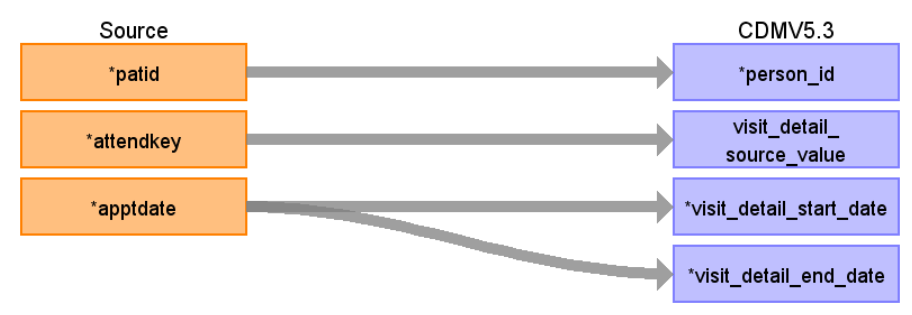

# CDM Table name: VISIT_DETAIL (CDM v5.3 / v5.4)

## Reading from hesop_appointment.

**Reading from hesop_appointment to Visit_Detail CDM v5.3 / v5.4 table:**

**Figure.1**

| Destination Field | Source field | Logic | Comment field |
| --- | --- | --- | --- |
| visit_detail_id |  | nextval('public.sequence_vd') AS visit_detail_id |  A sequence called "sequence_pro" is created in the public schema to ensure the unique generation of provider_id’s. Firstly,the value of the sequence is determined by querying the maximum ID from a predefined source ({TARGET_SCHEMA_TO_LINK}._max_ids) where the field "tbl_name" = "provider".The _max_ids table is established in the schema to be linked to the target schema, serving the purpose of storing maximum IDs for all CDM tables. This facilitates the determination of the next Provider_ID in the sequence. Additionally If attended <> 5 discard visit appointment detail ( we accept only attended = 5) |
| person_id | patid |  | |
| visit_detail_concept_id |  | 9202 = Outpatient visit |  |
| visit_detail_start_date | apptdate | |  |
| visit_detail_start_datetime | apptdate | |  |
| visit_detail_end_date | apptdate | | Appointment date will also be mapped to visit_detail_end_date because it's an outpatient appointment |
| visit_detail_end_datetime | apptdate | | |
| visit_detail_type_concept_id |  | 32818 = "EHR administration record” |  |
| provider_id | NULL|  | |
| care_site_id | NULL|  |  |
| visit_detail_source_value | attendkey | | This will allow us to retrieve visit_detail_id using patid. |
| visit_detail_source_concept_id |NULL  |  | |
| admitting_source_concept_id |NULL |  |  |
| admitting_source_value | NULL|  |  |
| discharge_to_concept_id |NULL |  |  |
| discharge_to_source_value |NULL  |  |  |
| preceding_visit_detail_id |  |  | Use patid + attendkey where to get the preceding visit_detail_id if any.|
| visit_detail_parent_id | NULL |  |  |
| visit_occurrence_id |  |  | Use Patid + attendkey to retrieve visit_occurrence_id from visit_occurrence |

