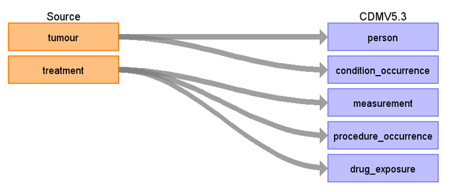

# National Cancer Registration and Analysis Service (NCRAS) ETL Documentation

These materials are meant to serve as documentation and reference for how the NCRAS dataset was converted to the [OMOP Common Data Model (CDM)](https://ohdsi.github.io/CommonDataModel/).

*NCRAS Data Mapping for CDM v5.3*

**Figure.1**

## Change log

### 24-June-2024
- Creation of documentation