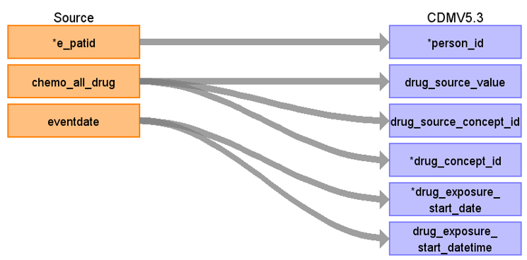

# CDM Table name: DRUG_EXPOSURE (CDM v5.3)

## Reading from Treatment table to Drug_exposure CDM v5.3 table:

**Figure.1**

| Destination Field | Source field | Logic | Comment field |
| --- | --- | :---: | --- |
|drug_exposure_id |  | | Autogenerate: if table is empty, start from MAX(public.drug_exposure_id)+1|
|person_id| e_patid | |PERSON_ID will be mapped from e_patid. |
|drug_concept_id|chemo_all_drug  | |DRUG_CONCEPT_ID will be mapped to a standard OMOP Concept_id by using NCRAS_DRUG_STCM. |
|drug_exposure_start_date|eventdate  |eventdate AS DRUG_EXPOSURE_START_DATE |DRUG_EXPOSURE_START_DATE will be mapped from eventdate. |
|drug_exposure_start_datetime|eventdate  |CAST(eventdate AS DATETIME) AS DRUG_EXPOSURE_START_DATETIME | DRUG_EXPOSURE_START_DATE will be mapped from eventdate.|
|drug_exposure_end_date|  | | |
|drug_exposure_end_datetime|  | | |
|verbatim_end_date|  | | |
|drug_type_concept_id|  |32879 |32879  = "Registry" |
|stop_reason|  | | |
|refills|  | | |
|quantity|  | | |
|days_supply|  | | |
|sig|  | | |
|route_concept_id|  | | |
|lot_number|  | | |
|provider_id|  | | |
|visit_occurrence_id|  | | |
|visit_detail_id|  | | |
|drug_source_value| chemo_all_drug | | DRUG_SOURCE_VALUE will be mapped to a standard OMOP Concept_id by using NCRAS_DRUG_STCM.|
|drug_source_concept_id| chemo_all_drug | | DRUG_SOURCE_CONCEPT_ID will be mapped to a standard OMOP Concept_id by using NCRAS_DRUG_STCM.|
|route_source_value|  | | |
|dose_unit_source_value|  | | |

