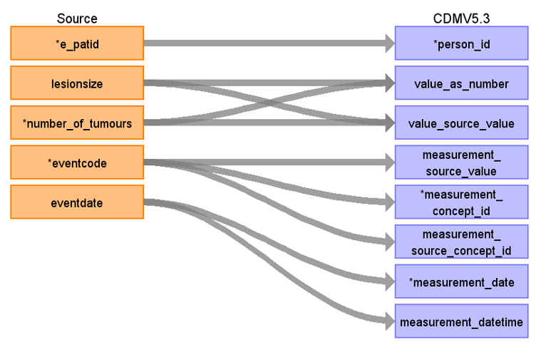

# CDM Table name: MEASUREMENT (CDM v5.3)

## Reading from Treatment to Measurement CDM v5.3

**Figure.1**

| Destination Field | Source field | Logic | Comment field |
| --- | --- | --- | --- |
|measurement_id |  |  | Autogenerate: if table is empty, start from MAX(public.measurement_id)+1|
|person_id |e_patid  |  | PERSON_ID will be mapped from e_patid.|
|measurement_concept_id |eventcode  |  | MEASUREMENT_CONCEPT_ID will be mapped to SNOMED Concept_id by using NCRAS_EVENTDESC_STCM.|
|measurement_date |eventdate  |  |MEASUREMENT_DATETIME will be mapped from eventdate. |
|measurement_datetime |eventdate  | CAST(eventdate AS DATETIME) AS MEASUREMENT_DATETIME |MEASUREMENT_DATETIME will be mapped from eventdate. |
|measurement_time |  |  | |
|measurement_type_concept_id |  |32818  |32818 = "EHR administration record" |
|operator_concept_id |  |  | |
|value_as_number | lesionsize |  | VALUE_AS_NUMBER will be mapped from lesionsize.|
|value_as_concept_id |  |  | |
|unit_concept_id |  | 8588 |8588 = "millimeter" |
|range_low |  |  | |
|range_high |  |  | |
|provider_id |  |  | |
|visit_occurrence_id |  |  | |
|visit_detail_id |  |  | |
|measurement_source_value |eventcode  |  |MEASUREMENT_SOURCE_VALUE will be mapped to Standard OMOP Concept_id by using NCRAS_EVENTDESC_STCM.  |
|measurement_source_concept_id |eventcode  |  |MEASUREMENT_SOURCE_CONCEPT_ID will be mapped to the exact value in the source data field eventcode |
|unit_source_value |  |  | |
|value_source_value |lesionsize,number_of_tumours  |  | VALUE_SOURCE_VALUE will be mapped from lesionsize and number_of tumours.|

