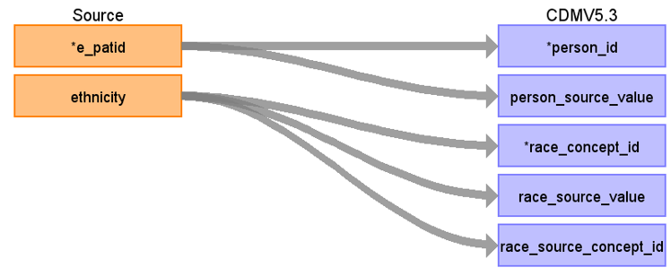

# CDM Table name: PERSON (CDM v5.3)

## Reading from Tumour

**Figure.1**

| Destination Field | Source field | Logic | Comment field |
| --- | --- | :---: | --- |
| person_id | e_patid | e_patid AS PERSON_ID|  Data like gender, year_of_birth, location_id, Care_site_id comes from AURUM/GOLD as the data are linked to them.|
| gender_concept_id | 0 | | |
| year_of_birth | 0 | | |
| month_of_birth | NULL|  | |
| day_of_birth | NULL |  |  |
| birth_datetime |NULL  |  |  |
| race_concept_id | ethnicity | |RACE_CONCEPT_ID will be mapped to race Concept_id by using CPRD_ETHINIC_STCM |
| ethnicity_concept_id | 0 |  |   |
| location_id |NULL  |  |  |
| provider_id | NULL |  |  |
| care_site_id | NULL| |  |
| person_source_value | e_patid|  |  |
| gender_source_value |NULL |  | |
| gender_source_concept_id | NULL |  |  |
| race_source_value | ethnicity|  |RACE_CONCEPT_ID will be mapped to race Concept_id by using CPRD_ETHINIC_STCM |
| race_source_concept_id | NULL | |
| ethnicity_source_value | NULL |  |  | 
| ethnicity_source_concept_id | 0 |  |  |

