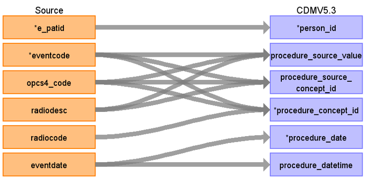

# CDM Table name: PROCEDURE_OCCURRENCE (CDM v5.3)

## Reading from Treatment.
**Reading from treatment to Procedure_Occurrence CDM v5.3 table:**

**Figure.1**

| Destination Field | Source field | Logic | Comment field |
| --- | --- | :---: | --- |
|procedure_occurrence_id |  | | Autogenerate: if table is empty, start from MAX(public.procedure_occurrence_id)+1|
|person_id |e_patid  | | PERSON_ID will be mapped from e_patid.|
|procedure_concept_id |opcs4_code,radiodesc,eventcode  |Case WHEN Oposc4_code IS NULL THEN radiocode ELSE eventcode END| PROCEDURE_SOURCE_VALUE will be mapped to standard Procedure Concept_id by using NCRAS_EVENTDESC_STCM,Oposc4_code,radiocode.|
|procedure_date |eventdate  | | PROCEDURE_DATE will be mapped from eventdate|
|procedure_datetime |eventdate  | CAST(eventdate AS DATETIME) AS PROCEDURE_DATE| PROCEDURE_DATETIME will be mapped from eventdate|
|procedure_type_concept_id |  |32879 |32879  = "Registry" |
|modifier_concept_id |  | | |
|quantity |  | 1| |
|provider_id |  | | |
|visit_occurrence_id |  | | |
|visit_detail_id |  | | |
|procedure_source_value |opcs4_code,radiodesc,eventcode  | Case WHEN Oposc4_code IS NULL THEN radiocode ELSE eventcode END| PROCEDURE_SOURCE_VALUE will be mapped to standard Procedure Concept_id by using NCRAS_EVENTDESC_STCM,Oposc4_code,radiocode.|
|procedure_source_concept_id |opcs4_code, radiodesc, eventcode | Case WHEN Oposc4_code IS NULL THEN radiocode ELSE eventcode END| PROCEDURE_SOURCE_VALUE will be mapped to standard Procedure Concept_id by using NCRAS_EVENTDESC_STCM,Oposc4_code,radiocode.|
|modifier_source_value |  | | |

