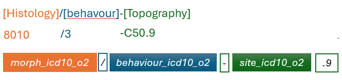
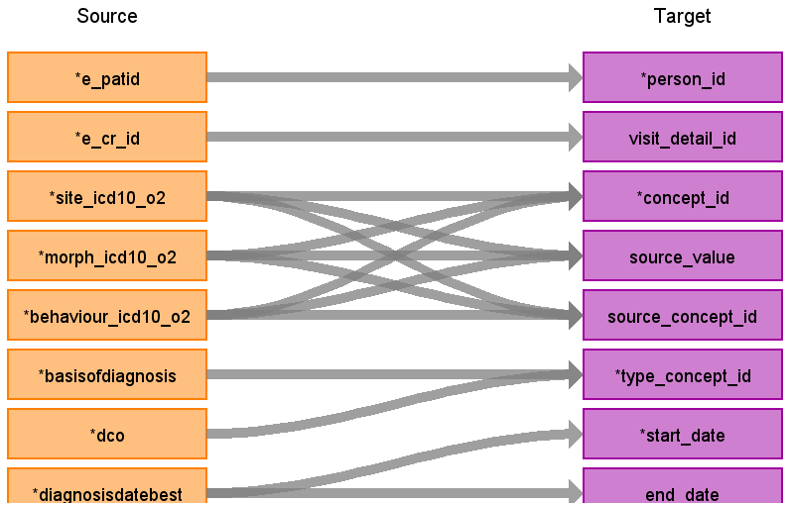

# CDM Table name: STEM
## Reading from Tumour:
---
### Scope:
Only **NCRAS data** within the *linkage_coverage* period are included. Records are restricted to patients that exist in the linked database (i.e. excluded if present in `source_nok`).

---

### Key conventions:
Cancer diagnoses are represented by concatenating the following source fields:
- `morph_icd10_o2`, 
- `behaviour_icd10_o2`
- `site_icd10_o2` 

**Format:**

**Rule:**
- If `site_icd10_o2` has only 3 characters, append `.9`

**Example:**
8010/3-C50.9

All cancer diagnoses in the form of **[Histology]/[behaviour]-[Topography]** are ideally mapped to the Condition or Measurement domains by using the ICDO3 vocabulary.  
When a match cannot be found in this way, site_icd10_o2 can be used on its own for the mapping using the ICD10 vocabulary. 
When site_icd10_o2 is null then site_coded can be used for the mapping using the ICD9CM vocabulary. 

With this approach, all the cancer diagnoses have been mapped to Athena standard concept_ids. 
Please note that using the Athena vocabularies, a minority of diagnoses are mapped to more than one standard concept_id. These concept_ids might belong to the same domain (i.e. Condition or Measurement) or not (i.e. spread between Condition and Measurement). 

---
## Reading from Tumour:
---

---

| Destination Field | Source field | Logic | Comment field |
| --- | --- | --- | --- |
| id |  | | Autogenerate |
| person_id | e_patid | | |
| visit_occurrence_id | | from visit_detail | |
| visit_detail_id | e_cr_id 'tumour' | Look up visit_detail_id based on the unique combination of e_cr_id and source table name | |
| concept_id | morph_icd10_o2 behaviour_icd10_o2 site_icd10_o2 | map these values in the form of [Histology]/[behavour]-[Topography] to the CDM Condition by using ICDO3 vocabulary. | |
| source_value | morph_icd10_o2 behaviour_icd10_o2 site_icd10_o2 | morph_icd10_o2 '/' behaviour_icd10_o2 '-' site_icd10_o2 '.9' | |
| source_concept_id | morph_icd10_o2 behaviour_icd10_o2 site_icd10_o2 | concept_id representing the source_value in Athna | |
| type_concept_id | basisofdiagnosis dco | basisofdiagnosis is mapped by using NCRAS_TUMOUR_BASIS_DIAG_STCM. if basisofdiagnosis=9, dco = 'Y' will be taken into consideration in the mapping. | |
| start_date | diagnosisdatebest | | |
| end_date | diagnosisdatebest | | |
| start_time | | '00:00:00' | |
| stem_source_table   | | 'Tumour'  | | 
| stem_source_id      | e_cr_id | | | 

### Cancer Modifiers
Cancer modifiers (e.g., stage, grade) are mapped to the Measurement table. Each modifier is linked to its corresponding diagnosis using measurement_event_id (set to the condition_occurrence_id) and meas_event_field_concept_id (set to [1147127](https://athena.ohdsi.org/search-terms/terms/1147127)). However, some cancer modifiers may not be adequately represented by Athena Measurement concepts. In cases where mapping to the Measurement domain is not feasible, these modifiers are mapped instead to the Observation table. 

**Stage:**

Stage in the form of **[stage system_]AJCC/UICC-Stage-[value]** (for example, **6th_AJCC/UICC-Stage-1A**) are mapped to the Measurement table by using the Cancer Modifier vocabulary, when stage_system is >=6. When stage_system < 6 there is no prefix before “AJCC/UICC”. [stage system] refers to stage_best_system, stage_img_system and stage_path_system, and [value] refers to stage_best, stage_img and stage_path. 

As the source data includes three sets of stage fields (_best, _img, and _path), the specific field names (e.g., stage_best, stage_img, stage_path) are stored in the value_source_value field for reference. Table 2 reports manual mapping for the Binet system present in stage_best. 

Table S3 reports manual mapping made when automatic mapping was not possible: we assigned “Tx/Nx” when T or N could not be determined. For metastasis, we assigned M1 where there was M2, M3, M4 because in the case of brain tumour, these codes could exist.  

**Table S2a: Source-to-standard mapping for cancer: stage_best**

| stage_best  | target_concept_id  | target_concept_name  | target_vocabulary_id | target_domain_id |
| --- | --- | --- | --- | --- |
| A  | 1635315  | Binet Stage A  | Cancer Modifier  | Measurement  |
| B  | 1635179  | Binet Stage B  | Cancer Modifier  | Measurement  |
| C  | 1635062  | Binet Stage C  | Cancer Modifier  | Measurement  |
| AJCC/UICC-STAGE-2S  | 1634209  | AJCC/UICC Stage 2  | Cancer Modifier  | Measurement  |
| AJCC/UICC-STAGE-3E  | 1633650  | AJCC/UICC Stage 3  | Cancer Modifier  | Measurement  |
| AJCC/UICC-STAGE-3S  | 1633650  | AJCC/UICC Stage 3  | Cancer Modifier  | Measurement  |
| AJCC/UICC-STAGE-4S  | 1633308  | AJCC/UICC Stage 4  | Cancer Modifier  | Measurement  |
| AJCC/UICC-STAGE-?  | 35919533  | Stage Unknown  | NAACCR  | Meas Value  |
| AJCC/UICC-STAGE-6  | 35919533  | Stage Unknown  | NAACCR  | Meas Value  |
| AJCC/UICC-STAGE-U  | 35919533  | Stage Unknown  | NAACCR  | Meas Value  |
| AJCC/UICC-STAGE-X  | 35919533  | Stage Unknown  | NAACCR  | Meas Value  |
| 6TH_AJCC/UICC-STAGE-4S  | 1635323  | AJCC/UICC 6th Stage 4  | Cancer Modifier  | Measurement  |
| 6TH_AJCC/UICC-STAGE-?  | 35919533  | Stage Unknown  | NAACCR  | Meas Value  |
| 6TH_AJCC/UICC-STAGE-6  | 35919533  | Stage Unknown  | NAACCR  | Meas Value  |
| 6TH_AJCC/UICC-STAGE-U  | 35919533  | Stage Unknown  | NAACCR  | Meas Value  |
| 7TH_AJCC/UICC-STAGE-2S  | 1634181  | AJCC/UICC 7th Stage 2  | Cancer Modifier  | Measurement  |
| 7TH_AJCC/UICC-STAGE-3S  | 1633382  | AJCC/UICC 7th Stage 3  | Cancer Modifier  | Measurement  |
| 7TH_AJCC/UICC-STAGE-4S  | 1633902  | AJCC/UICC 7th Stage 4  | Cancer Modifier  | Measurement  |
| 7TH_AJCC/UICC-STAGE-?  | 35919533  | Stage Unknown  | NAACCR  | Meas Value  |
| 7TH_AJCC/UICC-STAGE-6  | 35919533  | Stage Unknown  | NAACCR  | Meas Value  |
| 7TH_AJCC/UICC-STAGE-U  | 35919533  | Stage Unknown  | NAACCR  | Meas Value  |
| 7TH_AJCC/UICC-STAGE-X  | 35919533  | Stage Unknown  | NAACCR  | Meas Value  |
| 8TH_AJCC/UICC-STAGE-4S  | 1634131  | AJCC/UICC 8th Stage 4  | Cancer Modifier  | Measurement  |
| 8TH_AJCC/UICC-STAGE-?  | 35919533  | Stage Unknown  | NAACCR  | Meas Value  |
| 8TH_AJCC/UICC-STAGE-U  | 35919533  | Stage Unknown  | NAACCR  | Meas Value  |
| ANN_ARBOR-1A  | 1633291  | Ann Arbor Stage 1  | Cancer Modifier  | Measurement  |
| ANN_ARBOR-1AE  | 1633291  | Ann Arbor Stage 1  | Cancer Modifier  | Measurement  |
| ANN_ARBOR-1AEX  | 1633291  | Ann Arbor Stage 1  | Cancer Modifier  | Measurement  |
| ANN_ARBOR-1AX  | 1633291  | Ann Arbor Stage 1  | Cancer Modifier  | Measurement  |
| ANN_ARBOR-1B  | 1633291  | Ann Arbor Stage 1  | Cancer Modifier  | Measurement  |
| ANN_ARBOR-1BE  | 1633291  | Ann Arbor Stage 1  | Cancer Modifier  | Measurement  |
| ANN_ARBOR-2A  | 1634430  | Ann Arbor Stage 2  | Cancer Modifier  | Measurement  |
| ANN_ARBOR-2AE  | 1634430  | Ann Arbor Stage 2  | Cancer Modifier  | Measurement  |
| ANN_ARBOR-2AX  | 1634430  | Ann Arbor Stage 2  | Cancer Modifier  | Measurement  |
| ANN_ARBOR-2B  | 1634430  | Ann Arbor Stage 2  | Cancer Modifier  | Measurement  |
| ANN_ARBOR-2X  | 1634430  | Ann Arbor Stage 2  | Cancer Modifier  | Measurement  |
| ANN_ARBOR-3A  | 1635140  | Ann Arbor Stage 3  | Cancer Modifier  | Measurement  |
| ANN_ARBOR-3AE  | 1635140  | Ann Arbor Stage 3  | Cancer Modifier  | Measurement  |
| ANN_ARBOR-3B  | 1635140  | Ann Arbor Stage 3  | Cancer Modifier  | Measurement  |
| ANN_ARBOR-3BE  | 1635140  | Ann Arbor Stage 3  | Cancer Modifier  | Measurement  |
| ANN_ARBOR-3BS  | 1635140  | Ann Arbor Stage 3  | Cancer Modifier  | Measurement  |
| ANN_ARBOR-3BX  | 1635140  | Ann Arbor Stage 3  | Cancer Modifier  | Measurement  |
| ANN_ARBOR-3X  | 1635140  | Ann Arbor Stage 3  | Cancer Modifier  | Measurement  |
| ANN_ARBOR-4A  | 1633464  | Ann Arbor Stage 4  | Cancer Modifier  | Measurement  |
| ANN_ARBOR-4AE   | 1633464  | Ann Arbor Stage 4  | Cancer Modifier  | Measurement  |
| ANN_ARBOR-4B  | 1633464  | Ann Arbor Stage 4  | Cancer Modifier  | Measurement  |
| ANN_ARBOR-4BE  | 1633464  | Ann Arbor Stage 4  | Cancer Modifier  | Measurement  |
| ANN_ARBOR-4BEX  | 1633464  | Ann Arbor Stage 4  | Cancer Modifier  | Measurement  |
| ANN_ARBOR-4BS  | 1633464  | Ann Arbor Stage 4  | Cancer Modifier  | Measurement  |
| ANN_ARBOR-4BX  | 1633464  | Ann Arbor Stage 4  | Cancer Modifier  | Measurement  |
| ANN_ARBOR-4E  | 1633464  | Ann Arbor Stage 4  | Cancer Modifier  | Measurement  |
| ANN_ARBOR-4ES  | 1633464  | Ann Arbor Stage 4  | Cancer Modifier  | Measurement  |
| ANN_ARBOR-4S  | 1633464  | Ann Arbor Stage 4  | Cancer Modifier  | Measurement  |
| ENETS 2007-1  | 1635838  | Stage 1  | Cancer Modifier  | Measurement  |
| ENETS 2007-1A  | 1635838  | Stage 1  | Cancer Modifier  | Measurement  |
| ENETS 2007-1B  | 1635838  | Stage 1  | Cancer Modifier  | Measurement  |
| ENETS 2007-2A  | 1635131  | Stage 2  | Cancer Modifier  | Measurement  |
| ENETS 2007-2B  | 1635131  | Stage 2  | Cancer Modifier  | Measurement  |
| ENETS 2007-3A  | 1634191  | Stage 3  | Cancer Modifier  | Measurement  |
| ENETS 2007-3B  | 1634191  | Stage 3  | Cancer Modifier  | Measurement  |
| ENETS 2007-4  | 1633987  | Stage 4  | Cancer Modifier  | Measurement  |
| ENETS 2007-?  | 35919533  | Stage Unknown  | NAACCR  | Meas Value  |
| ENETS 2007-U  | 35919533  | Stage Unknown  | NAACCR  | Meas Value  |
| FIGO-2C  | 1634127  | FIGO Stage 2  | Cancer Modifier  | Measurement  |
| FIGO-3A1I  | 1634024  | FIGO Stage 3  | Cancer Modifier  | Measurement  |
| FIGO-3A1II  | 1634024  | FIGO Stage 3  | Cancer Modifier  | Measurement  |
| FIGO-3BII  | 1634024  | FIGO Stage 3  | Cancer Modifier  | Measurement  |

| Destination Field | Source field | Logic | Comment field |
| --- | --- | --- | --- |
| id |  | | Autogenerate |
| person_id | e_patid | | |
| visit_occurrence_id | | from visit_detail | |
| visit_detail_id | e_cr_id 'tumour' | Look up visit_detail_id based on the unique combination of e_cr_id and source table name | |
| concept_id | tumoursize nodesexcised, nodesinvolved tumourcount, bigtumourcount chrl_tot_27_03, chrl_tot_78_06 grade stage_best, stage_img, stage_path t_best, n_best, m_best t_img, n_img, m_img t_path, n_path, m_path gleason_primary, gleason_secondary, gleason_tertiary, gleason_combined | source_value is mapped by using Cancer Modifier, NCRAS_TUMOUR_MODIFIER_STCM, NCRAS_TUMOUR_GRADE_STCM, NCRAS_TUMOUR_GLEASON_PRI_STCM, NCRAS_TUMOUR_GLEASON_SEC_STCM, NCRAS_TUMOUR_GLEASON_TER_STCM and NCRAS_TUMOUR_BASIS_DIAG_STCM | |
| source_value | tumoursize nodesexcised, nodesinvolved tumourcount, bigtumourcount chrl_tot_27_03, chrl_tot_78_06 grade stage_best, stage_img, stage_path t_best, n_best, m_best t_img, n_img, m_img t_path, n_path, m_path gleason_primary, gleason_secondary, gleason_tertiary, gleason_combined | | |
| source_concept_id | tumoursize nodesexcised, nodesinvolved tumourcount, bigtumourcount chrl_tot_27_03, chrl_tot_78_06 grade stage_best, stage_img, stage_path t_best, n_best, m_best t_img, n_img, m_img t_path, n_path, m_path gleason_primary, gleason_secondary, gleason_tertiary, gleason_combined | concept_id representing the source_value in Athna for standard terminology. 0 for customised source_code. | |
| type_concept_id | basisofdiagnosis dco | basisofdiagnosis is mapped by using NCRAS_TUMOUR_BASIS_DIAG_STCM. if basisofdiagnosis=9, dco = 'Y' will be taken into consideration in the mapping. | |
| start_date | diagnosisdatebest | | |
| end_date | diagnosisdatebest | | |
| start_time | | '00:00:00' | |
| value_as_number     | tumoursize nodesexcised, nodesinvolved tumourcount, bigtumourcount chrl_tot_27_03, chrl_tot_78_06 grade stage_best_system, stage_best, stage_img, stage_path stage_img_system, t_best, n_best, m_best t_img, n_img, m_img stage_path_system, t_path, n_path, m_path gleason_primary, gleason_secondary, gleason_tertiary, gleason_combined | | | 
| unit_source_value   | | 'mm' for tumoursize 'month' for chrl_tot_27_03 and chrl_tot_78_06 | | 
| value_source_value  | source data field name | | There are 3 sets of AJCC/UICC code in source data indentified by prefix(e.g. best_, img_, and path_) in the source data field name  | 
| stem_source_table   | | 'Tumour-[modifier name]'  | | 
| stem_source_id      | e_cr_id | | | 

## Reading from treatment

### Treatment

| Destination Field | Source field | Logic | Comment field |
| --- | --- | --- | --- |
| id |  | | Autogenerate |
| person_id | e_patid | | |
| visit_occurrence_id | | from visit_detail | |
| visit_detail_id | e_cr_id 'treatment' | Look up visit_detail_id based on the unique combination of e_cr_id and source table name | |
| concept_id | opcs4_code eventdesc radiodesc chemo_all_drug | source_value is mapped by using OPCS4, RXNorm, RxNorm Extension and NCRAS_STCM. | |
| source_value | opcs4_code eventdesc radiodesc chemo_all_drug | | |
| source_concept_id | opcs4_code eventdesc radiodesc chemo_all_drug | concept_id representing the source_value in Athna for standard terminology. 0 for customised source_code. | |
| type_concept_id | basisofdiagnosis dco | basisofdiagnosis is mapped by using NCRAS_TUMOUR_BASIS_DIAG_STCM. if basisofdiagnosis=9, dco = 'Y' will be taken into consideration in the mapping. | |
| start_date | eventdate | | |
| end_date | eventdate | | |
| start_time | | '00:00:00' | |
| stem_source_table   | | 'Treatment'  | | 
| stem_source_id      | treatment_id | | | 

### Additional information about treatment

| Destination Field | Source field | Logic | Comment field |
| --- | --- | --- | --- |
| id |  | | Autogenerate |
| person_id | e_patid | | |
| visit_occurrence_id | | from visit_detail | |
| visit_detail_id | e_cr_id 'tumour' | Look up visit_detail_id based on the unique combination of e_cr_id and source table name | |
| concept_id | number_of_tumours within_six_months_flag six_months_after_flag lesionsize | source_value is mapped by using NCRAS_TREATMENT_MODIFIER_STCM | |
| source_value | number_of_tumours | | |
| source_concept_id | number_of_tumours | 0 | |
| type_concept_id | basisofdiagnosis dco | basisofdiagnosis is mapped by using NCRAS_TUMOUR_BASIS_DIAG_STCM. if basisofdiagnosis=9, dco = 'Y' will be taken into consideration in the mapping. | |
| start_date | diagnosisdatebest | | |
| end_date | diagnosisdatebest | | |
| start_time | | '00:00:00' | |
| value_as_number     | number_of_tumours lesionsize within_six_months_flag six_months_after_flag |6 for within_six_months_flag and six_months_after_flag | | 
| value_as_string     | within_six_months_flag six_months_after_flag | 'Y'/'N' | |
| unit_source_value   | | 'mm' for lesionsize 'month' for within_six_months_flag and six_months_after_flag | | 
| qualifier_concept_id | within_six_months_flag six_months_after_flag |  [4172704](https://athena.ohdsi.org/search-terms/terms/4172704) for six_months_after_flag [4171754](https://athena.ohdsi.org/search-terms/terms/4171754) for within_six_months_flag | | 
| qualifier_source_value | within_six_months_flag six_months_after_flag | '>' for six_months_after_flag '<=' for within_six_months_flag | | 
| stem_source_table   | | 'Treatment-Modifier'  | | 
| stem_source_id      | treatment_id | | | 