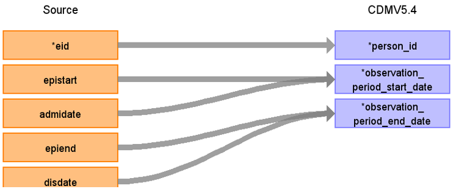

# CDM Table name: observation_period (CDM v5.4)

## Reading from source_ukb_hesin.hesin, public_ukb.death

| Destination Field | Source field | Logic | Comment field |
| --- | --- | :---: | --- |
| observation_period_id |  |  |  Autogenerate|
| person_id | eid | | |
| observation_period_start_date | epistart,admidate | If epistart is null then use admidate| |
| observation_period_end_date |death.date_of_death, disdate, epiend, admidate, epistart | If date_of_death is null then use the first not null of (disdate,epiend,admidate)| |
| period_type_concept_id | | [32880 - Standard algorithm](https://athena.ohdsi.org/search-terms/terms/32880)| |
