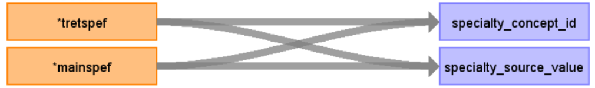

# CDM Table name: provider (CDM v5.3 / v5.4)

## Reading from source_ukb_hesin.hesin

| Destination Field | Source field | Logic | Comment field |
| --- | --- | :---: | --- |
| provider_id | | nextval('public.sequence_pro') AS provider_id| Autogenerate|
| provider_name | NULL |  |  |
| npi | NULL |  |  |
| dea |NULL  |  |  |
| specialty_concept_id | tretspef, mainspef | ||
| care_site_id | NULL| | |
| year_of_birth | NULL |  |  |
| gender_concept_id | NULL | |  |
| provider_source_value | NULL |  | |
| specialty_source_value | tretspef, mainspef | specialty_source_value will be mapped to Athena Standard Concept by using HES_SPEC_STCM ||
| specialty_source_concept_id |NULL  |  | |
| gender_source_value | NULL| |  |
| gender_source_concept_id | NULL |  | |