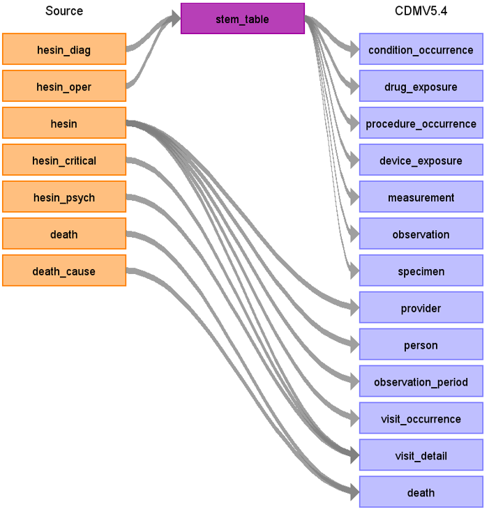

# UK BioBank Hospital Episode Statistics Inpatient ETL Documentation

These materials are meant to serve as documentation and reference for how the UK BioBank Hospital Episode Statistics Inpatient (HESIN) ETL Documentation data was converted to the OMOP Common Data Model (CDM).

**UKB HESIN source Data Mapping for CDM v5.4**

**Figure.1**

## Change log

### 17-Sep-2024
- Creation of documentation